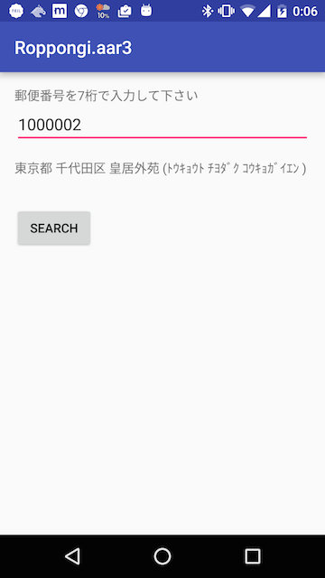
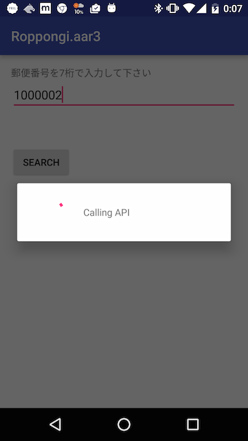

# Super simple address search app

- このアプリは [Roppongi.aar3](http://roppongi-aar.connpass.com/event/33989/) にて、How to implement "Network API client Activity" in 2016 という発表のために用意したアプリです

## 主張したいこと

- 下記を使っており、2016年だからこその小さな実装になっています
  - databinding (双方向binding)
  - RxJava
- 画面回転やアプリの表裏遷移を考慮した作りになっています
  - API通信を一度叩いたら、途中で画面回転などが挟まったとしても、ちゃんと応答を待って受け取ることが出来ます
  - Waitダイアログは、完了したタイミングでちゃんと消えます (中途半端なところで消えない)
